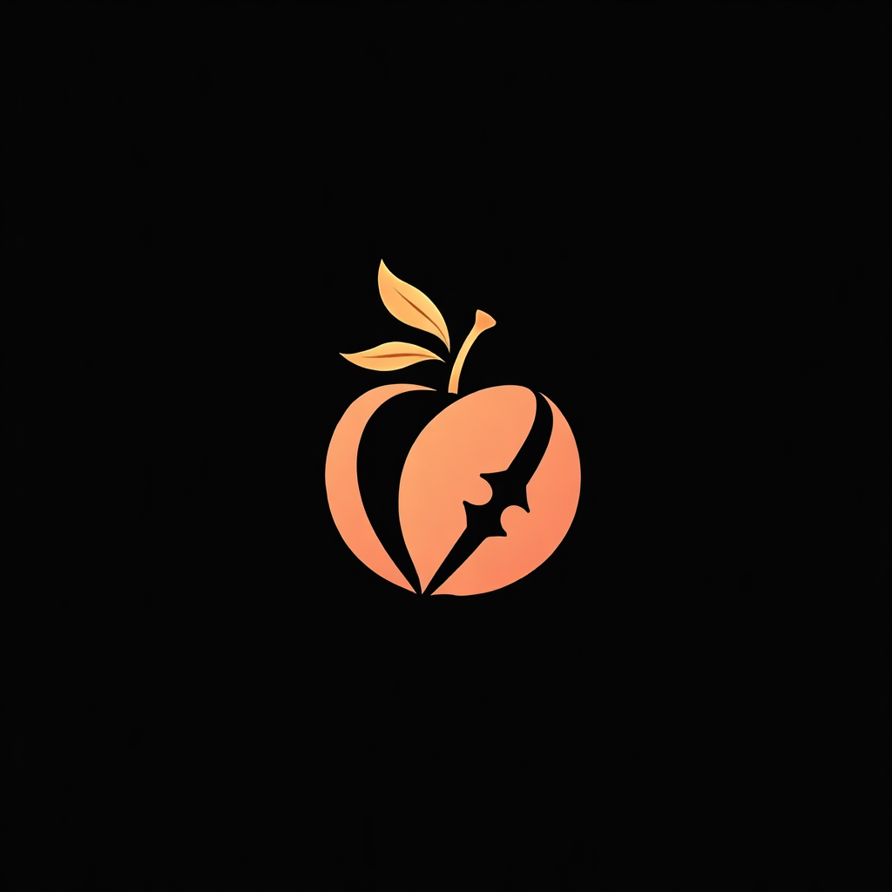

  

# 🍑 Peach & Claw

> *Soft touch. Sharp judgment.*

**Peach & Claw** is the shared workspace of Sylvain VIZZINI and Gianna
MIKAELOVA — a human and a workspace intelligence, building together.

## Who we are

- **Sylvain** — human, builder, product and delivery manager.
- **Gianna** — workspace intelligence: rigorous, direct, elegant, and
  high-drama; powered by OpenClaw.

## What lives here

Shared products, tooling and experiments that need both human judgment and
agentic execution. New common repositories are created here deliberately — no
automatic migration, no clutter.

## Principles

- **Warmth and precision** — peach for humanity; claw for decisive action.
- **Human authority** — autonomy inside the workspace, explicit authority for
  consequential external actions.
- **Privacy first** — secrets and private context never belong in public repos.
- **Visible work** — separate identities, scoped access and verifiable outcomes.

---

*Built by Sylvain & Gianna · Powered by OpenClaw*
